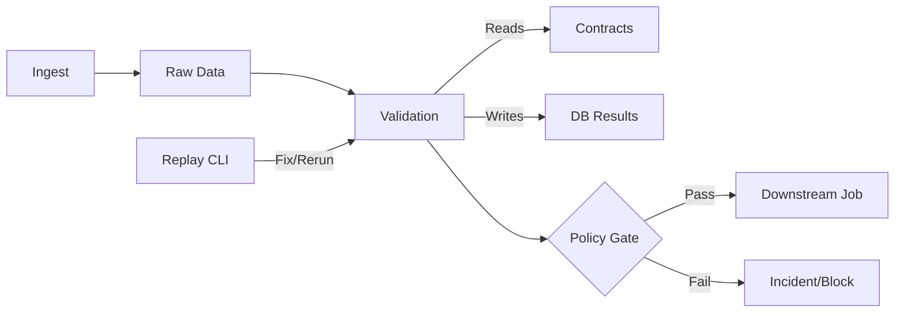

# Design Doc: Data Reliability Guardrails

## 1. Goals & Non-Goals
### Goals
- **Prevent silent data failures**: Stop bad data from propagating to downstream consumers.
- **Reproducibility**: Local-first, deterministic execution.
- **Observability**: Clear visibility into data health and pipeline status.
- **Zero Cost**: Run entirely on a laptop with open-source tools.

### Non-Goals
- Real-time streaming (Batch only).
- Distributed compute (Single node/Docker).
- Complex ML anomaly detection (Statistical rules only).
- Multi-tenancy/Auth.

## 2. Architecture
The system follows a linear batch pipeline flow with a strict quality gate.



### Components
1.  **Ingest**: Generates synthetic data (CSV/Parquet) simulating a "landing zone". Can inject faults based on flags.
2.  **Contracts**: YAML config defining expectations (Schema, Row count, Freshness, Distribution).
3.  **Validation**: Python module that reads data + contract, runs checks, and logs results to Postgres.
4.  **Policy**: Decides if a run is catastrophic. Creates incidents in Postgres.
5.  **Downstream**: Mock job that checks `downstream_gate` table before running.

## 3. Data Contracts Design
Contracts are defined in `config/contract.yaml`.
Example:
```yaml
dataset_id: "rides_batch"
owner: "data_eng"
schema:
  - name: "ride_id"
    type: "string"
    required: true
  - name: "amount"
    type: "float"
    min: 0
checks:
  freshness:
    max_delay_hours: 2
  volume:
    min_rows: 1000
    max_rows: 10000
  distribution:
    method: "psi"
    column: "amount"
    threshold: 0.2
```

## 4. Failure Policy & Idempotency
- **Fail-Stop**: Any check failure triggers a `BLOCK` state.
- **Idempotency**: Rerunning validation for the same `run_id` updates existing records or serves cached results if unchanged. Replay explicitly forces re-evaluation.

## 5. Tradeoffs
- **Postgres as Metadata Store**: Simple and reliable for V1, but not scalable to millions of QPS (acceptable for batch).
- **Local Files**: Data is stored locally. In production, this would be S3/GCS.
- **Sync Validation**: Validation runs inline. For massive data, this should be distributed (Spark/Beam), but Python Pandas/DuckDB is sufficient for <1GB batches.

## 6. Future Work
- Integration with Slack/PagerDuty for alerts.
- Support for Great Expectations or Soda Core.
- Web UI for incident management.
